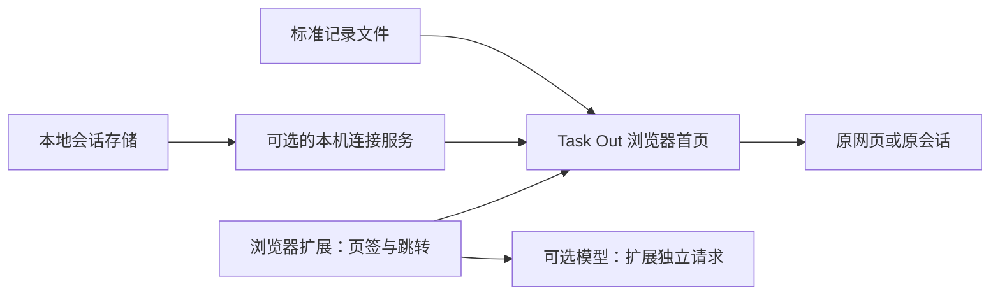

# Task Out 产品方案 v1.4

> 在一个浏览器页面里，按正在做的事整理网页和 Agent 会话，快速看清最近发起了什么、进展到哪里，以及哪些内容可以收起。

状态：产品方案与首版实现说明；已进入开发验收阶段。

更新：2026-09-18。

代码仓库：[yuuuyua-ux/task-out](https://github.com/yuuuyua-ux/task-out)。后续代码与公开文档在此仓库迭代。

公开文档约定：本文只使用通用规则和虚构示例，不包含个人会话、机器路径或连接凭据。

此前确认的**整理偏好记忆仍待实现**，对应第 8.4 节；基础功能继续按下文现有实现与验收状态说明，不因本文更新而视为该功能已开发完成。

本次补充：主要类型收敛为固定七类，每条记录至多一个；会话默认每 60 秒检查进展，可配置频率。新会话只自动归类一次，已有会话仅更新近况，不自动改变项目、类型或固定名称。设置增加 Task Out 自身的用量与费用估算；恢复归档成功后的声效和动画反馈。此前的近 3 / 7 / 30 天范围、原标题加地址分类、稳定会话名称、人工调整和撤销规则继续有效。

## 1. 方案结论

Task Out 面向同时使用浏览器和多个 Agent 工具的个人用户。它提供统一查看和整理入口，原工具继续负责对话与执行。

| 核心决策 | 产品规则 |
|---|---|
| 项目组织内容 | 项目是一级组织，按用户的工作目标命名，不绑定本地工作目录 |
| 一个主要类型 | 从调研分析、需求规划、方案设计、开发实现、测试排障、文档整理、使用咨询中选择一个，也可未设置；跨来源统一筛选 |
| 聚合展示 | 每条会话保持独立身份和上下文，不因主题相同而合并对话 |
| Close 即归档 | 一个入口、一套生命周期，可恢复；不代表业务完成或停止 Agent |
| 来源可扩展 | 通过连接器、连接配置和来源识别规则接入，不在首页固定应用列表 |
| LLM 辅助整理 | 用于项目建议、类型标签、缺失的会话名称和近况摘要；手动调整优先，来源和运行状态依靠原始数据 |
| 近期任务范围 | 每个会话连接选择近 3 / 7 / 30 天，默认 30 天；按真实最近活动滚动获取，不因刷新或文件复制而进入窗口 |
| 整理偏好记忆（待实现） | 保存用户明确设置或确认过的整理偏好，按适用范围参与后续分组；系统推测先作为候选，不自动成为长期规则 |

### 当前实现与验收状态

当前仓库已提供 Chrome MV3 扩展和 Node.js 本机服务，首页使用真实页签和已接入会话。项目、标签、人工修正、书签及归档使用 IndexedDB 持久保存；可发现、配置、测试和增量同步两种本地会话格式，并提供标准导入与模型建议预览。

已确认的运行方式：**模型由扩展独立直连，本机服务仅负责本地会话读取。** 模型 Key 限于扩展 `chrome.storage.local` 的 `TRUSTED_CONTEXTS`，服务不接收 Key。服务通过 macOS 一键脚本或 `npm start` 启动为独立后台进程，启动成功后可关闭终端。设置页提供运行状态、刷新与停止入口；停止保留记录和配对，不停止来源 Agent。重复启动复用同一服务，电脑重启后手动启动，不设置开机自启。

首版连接器为 Codex rollout 与 Claude 格式 JSONL：具备历史与增量读取，已在本机选定来源实际读取主会话与子会话，相关实测关闭来源 AI 权限并检查重复同步身份。记录数量随时间窗口与来源活动变化，以[验证记录](validation.md)所注明的实测时间和范围为准。实时运行状态保持未知，尚无经验证的原会话直达能力；`sdk-ts` 不固定识别为 Mana。

Chrome 已实际加载首页、展示真实页签、验证 worker 重载后记录保留，并完成本机地址权限与配对。来源通过本机 API 发现、预览并启用后，首页已展示真实主会话；完整 Chrome 表单、归档恢复和模型建议交互仍有待验收项。自动回归不能代替 Chrome 实机及干净安装验收，当前尚未宣布正式发布。具体测试结果、证据与待验收项见[验证记录](validation.md)；后文的扩展目标与验收标准不应一概视为已验收能力。

## 2. 用户问题与产品目标

| 用户要回答的问题 | Task Out 提供的结果 |
|---|---|
| 最近又发起了哪些事情？ | 按原始发起时间查看近期会话及类型分布，区分新会话与旧会话的新进展 |
| 同一件事散在哪些工具里？ | 一个项目卡片内收纳相关网页和独立会话，通过来源图标区分 |
| 哪些事情需要我处理？ | 展示有明确依据的等待状态、最近进展和下一步，支持回到原处 |
| 哪些内容可以暂时收起？ | 单条、整组或当前筛选结果归档，保留记录并支持恢复 |
| 换了工具或电脑还能用吗？ | 发现已有兼容来源、手动调整配置、导入标准记录；核心界面不依赖某个品牌 |

首版建议以以下结果验收，而不是以接入品牌数量衡量价值：

- 无需配置模型，也能接入兼容来源、查看记录、手动归类和归档。
- 不同工具、不同目录的内容可以归入同一项目；同一目录的内容也可以分属不同项目。
- 用户能看出信息是否新鲜、来源是否连通、哪些操作真实可用。
- 在一台没有开发者个人配置的电脑上，可以依据公开说明完成首次使用。

可记录的评估指标包括首次接入成功率、回到原会话的成功率、整理建议采纳率和手动纠正率。首版不默认上传使用数据，先用本地记录与试用反馈建立基线，再确定数值目标。

## 3. 载体与范围

### 3.1 推荐载体

沿用浏览器页面作为统一入口，保留扩展的新标签页形态。读取本地 Agent 数据时，通过可选的本机连接服务完成；它作为后台组件运行，不增加第二套主操作界面。

| 使用方式 | 可用能力 | 边界 |
|---|---|---|
| 浏览器扩展 | 当前浏览器授权范围内的页签、跳转、关闭、手动整理和独立模型建议 | 不安装本机服务时，不读取本地 Agent 存储 |
| 扩展 + 本机连接服务 | 在网页能力基础上，发现并同步兼容的本地会话；授权后可由扩展整理 | 首版仅提供两种本地 JSONL 格式连接器，其他协议需适配 |
| 普通网页预览 + 标准导入 | 预览导入记录与整理交互 | 不具备扩展持久化、页签管理、本机连接与真实模型请求能力 |

仅将静态页面部署到 GitHub Pages，不能自动读取访问者的本地 Agent 数据，也不获得系统凭据访问能力。真实模型调用由扩展直接请求用户配置的模型接口；本机服务不代理模型请求、不保存模型凭据。没有本机服务时，网页整理与已导入记录的授权整理仍可在扩展中使用。普通网页预览和已安装扩展应明确区分。

### 3.2 首版支持与非目标

| 范围 | 内容 |
|---|---|
| 支持 | 项目卡片、类型标签、来源筛选、近期发起、会话近况、网页直开、稍后查看、归档恢复；来源发现与配置；模型设置与建议预览 |
| 有条件支持 | 实时状态、原会话直达、事件更新等能力，按连接器与当前环境逐项验证 |
| 不支持 | 合并聊天上下文、代发消息、自动接力、统一执行任务、启动或停止 Agent、多用户协作、跨设备同步 |
| 后续扩展 | 更多来源协议、第三方连接器安装、复杂字段映射、规则编辑器和源工具原生归档同步 |

首版验收目标为 macOS + Chrome，本机运行环境为 Node.js 24.12.x。其他平台待验证；不使用固定用户名或机器路径不等于支持所有操作系统和浏览器。

## 4. 来源设计：读取方式、连接位置与应用身份分开

### 4.1 核心对象

| 对象 | 用户可以怎样理解 | 规则 |
|---|---|---|
| 连接器 | 一种可用的读取方式，例如浏览器页签、某种会话文件格式、某个服务协议 | 定义如何发现、解析、识别记录，以及支持哪些操作；可以新增和升级 |
| 连接配置 | 我实际要连接的一处数据 | 同一连接器可以添加多条配置，例如个人与工作环境；名称、位置、范围可改 |
| 应用身份 | 这条会话来自哪个应用，或能在哪些应用里打开 | 来自记录中的标记或用户确认；允许未知和多个入口，不等同于文件格式 |
| 统一记录 | 一条独立会话，或一个实际网页页签及其保留记录 | 保留稳定身份和来源依据；项目、标签、归档与用户修正由 Task Out 管理 |
| 能力说明 | 这条连接现在能做什么 | 分别展示历史读取、状态更新、打开原处等能力，不能用一个“已连接”概括全部 |

例如，两个 Agent 产品可能共用同一种会话格式。应读取同一存储一次，再识别每条会话的应用身份；不应为两个品牌各扫描一次，产生两份相同会话。

### 4.2 “不写死来源”的具体要求

| 位置 | 必须支持的变化 |
|---|---|
| 连接器目录 | 新增一种读取方式，不要求修改项目、标签、归档等通用功能 |
| 配置表单 | 按连接器声明的字段显示路径、服务地址、账号范围等输入；没有该能力的字段不出现 |
| 来源筛选与分组 | 根据已接入的来源和记录动态生成，不能只判断几个预置品牌 |
| 图标与名称 | 连接器提供默认图标和名称；可设置本地别名，缺少图标时使用通用标识 |
| 操作按钮 | 按当前记录的可用能力展示；“可读历史”不自动获得“可直达会话” |
| 项目和类型 | 项目名称与工作目录不固定；主要类型使用统一七类，来源接入不新增品牌或主题类型 |
| 模型 | 支持填写模型名称和服务地址；模型供应商与对话来源互不绑定 |

允许连接器内维护已知格式和候选位置，但这些规则必须可维护、可覆盖，并与通用界面分离。

**扩展分为两种情况：** 新应用使用已有兼容格式时，新增连接配置或身份识别规则即可；新应用使用未支持协议时，需要新增连接器，或先导入标准记录。不能承诺任意目录、任意 URL 都能直接接入。

## 5. 来源发现与配置体验

### 5.1 入口与首次使用

首页只保留统一“设置”，在其中的“会话来源”进入“接入会话来源”。连接管理显示已有连接与服务状态，保留手动添加和标准导入；读取位置与模型设置独立。

首次使用不强制配置 LLM：用户可以先使用浏览器功能，接入其他来源后再决定是否开启 AI 整理。

### 5.2 自动发现流程

1. **启动**：说明扩展与本机服务各自职责，指向下载文件夹中的一键启动脚本。启动窗口显示地址、配对码和有效期，页面可主动检查服务；首次操作不读取会话。
2. **配对**：输入启动窗口的配对码，首次授予 Chrome 对指定本机地址的访问权限；自定义地址放在高级设置。成功后保留配对凭据，配对码不进入草稿。配对码不正确、过期、已使用分别说明，不让用户反复提交失效码。
3. **发现**：使用连接器声明、当前用户环境和可覆盖位置检查候选会话目录、实际存在的名称资料文件位置，只检查目录和文件元数据。候选以普通名称、图标、识别说明呈现，实际路径可展开查看；按实际目录去重，多个 SDK 客户端共用目录只显示一次。不存在和无法访问分别给出提示，不固定按 SDK 标记认定为 Mana。
4. **预览**：选择候选后明确列出将读取的日志目录、可选名称资料目录与时间范围；格式、目录、身份修正等收在高级设置。用户点击“读取并预览”才授权读取该范围，不开启持续同步或模型外发。按最近活动统计整个本次可读取范围内的主会话和子会话，按稳定身份去重；最多展示 10 条且主会话优先。样例限制与扫描未完整区分提示，不能用 10 条样例冒充总量。
5. **启用**：用户核对预览后确认。有效但当前时间窗没有会话时可启用等待新活动；格式不支持或无读取权限时先处理，不通过直接保存或编辑连接绕过。连接保存成功与首次同步成功分开反馈；同步失败保留连接与草稿状态，提供重试，不重复添加。

引导步骤与不含配对码的配置草稿保存在扩展本地，关闭后可继续。重新进入待启用步骤时重新预览；读取范围变化使旧预览失效。服务未启动、Chrome 未授予本机权限、连接凭据失效、目录不存在、读取权限不足、格式不支持和近期无会话各有可执行的下一步。macOS 可调起系统目录选择器；取消不算错误，不支持的平台或选择器失败时允许手填绝对路径。

发现不会读取格式头或会话正文；格式和客户端身份在用户选定范围并预览后确认。没有发现兼容候选不能推断电脑上没有 Agent，保留手动选择和标准导入路径。同步完成后展示真实能力与限制，历史读取不能被表述为实时运行监测。

### 5.3 连接配置

| 配置项 | 产品行为 |
|---|---|
| 显示名称 | 用户自行命名，例如“工作环境”；只改显示，不改变记录身份 |
| 读取方式 | 从兼容连接器中选择，展示用途与当前版本支持范围 |
| 数据位置 | 选择目录、文件或填写兼容服务地址；默认位置只是建议，允许修改 |
| 账号或环境 | 仅在连接器支持时提供；不同账号不能混为同一存储 |
| 获取范围 | 每个会话连接选择近 3 / 7 / 30 天，默认 30 天；按来源记录的最近活动滚动计算，包含窗口起点；不提供全部历史 |
| 名称资料位置 | 连接器有独立名称存储时可显式选择；Codex 支持名称索引及兼容状态数据库，发现候选不会自动读取 |
| 刷新方式 | 扩展会话与进展默认 60 秒，可选 0 / 30 / 60 / 120 / 300 秒，0 为仅手动；连接本地读取间隔独立配置，新连接默认 60 秒 |
| 应用身份 | 自动识别；无法确定时使用通用标识，允许用户确认或纠正 |
| 打开方式 | 使用连接器提供且已验证的入口；需要配置时允许补充，不要求填写任意 shell 命令 |
| 模型使用范围 | 控制是否允许标题参与 AI 整理；近况、用于缺名会话命名的首条与最新消息分别授权，多连接取更严格限制 |

目录选择只决定读取范围，不创建同名项目，也不约束项目归属。最近活动时间未知或在未来的记录不进入当前窗口；创建时间未知但最近活动可信时仍可收录。不能用文件修改、复制或同步时间补齐来源时间。

窗口持续滚动。收窄范围或记录自然过期后，未归档记录从当前内容和稍后查看中隐藏，但本地缓存、项目、标签、固定名称和其他整理结果保留；扩大范围后，重新进入窗口的记录恢复显示。归档记录继续保留。共享会话采用连接获取范围的并集，模型许可仍取交集；暂停或离线的缓存按原窗口展示。旧版“全部历史”配置升级为 30 天，不清除已有整理。该范围不筛除仍打开的浏览器页签。

连接详情提供测试、重试、暂停、恢复、编辑和移除。暂停停止后续采集并保留缓存；移除默认断开连接并保留已收录内容，不能删除源文件。若提供清除缓存，另行明确说明并确认范围。

### 5.4 连接状态与能力展示

| 情况 | 界面与行为 |
|---|---|
| 待配置 | 标明缺失项；未通过必要配置前不显示“已连接” |
| 正在同步 | 显示进度，已读取部分可以查看；允许停止后续同步 |
| 可用 | 显示最后同步时间，以及各项已验证能力 |
| 部分可用 | 例如可读历史但不能获取实时状态；保留可用功能并说明限制 |
| 需要授权 / 配置失效 | 保留原配置和缓存，指出需处理的字段，提供重试入口 |
| 暂停 / 离线 | 展示缓存和最后成功同步时间，不持续播放运行中动画 |
| 格式不兼容 | 显示受影响连接及升级或导入方案，其他来源继续工作 |

“测试读取成功”“实时状态可用”“可打开原会话”分别记录结果。后两项应以实际事件或定位验证为依据，不能由配置存在或接口返回成功推定。

## 6. 应用身份与重复记录

### 6.1 应用身份识别

优先使用明确客户端标记和连接器可验证的信息；用户确认作为本地修正保存。未知时展示“来源待识别”，不能靠 LLM、目录名或图标猜测品牌。

以共享的 Claude 格式存储为例：`sdk-ts` 只说明 SDK 入口，不足以唯一证明来自 Mana；`cli` 是 CLI 入口线索，也不能据此识别所有未来客户端。这是格式与应用身份分离的示例，不构成产品对这些品牌的固定依赖。

首版支持纠正单条或所选多条记录的来源，并保存依据。P1 再增加面向未来记录的识别规则：规则预览必须显示适用范围；“将所选记录标为某应用”和“将该范围未来记录也标为该应用”是两个选择，默认只改所选记录。规则可编辑、撤销，冲突时保留待识别状态。

### 6.2 去重与关联

| 场景 | 处理规则 |
|---|---|
| 同一连接重复刷新 | 更新原记录，不新增会话 |
| 同一存储由多条连接发现 | 使用存储身份和原始会话标识关联，首页只显示一条，保留多个可用入口 |
| API 与文件同时提供同一会话 | 只有存在可靠身份对应时才关联；无法证明时标记候选，不强行合并 |
| 客户端名称纠正或新增入口 | 修改身份说明或打开方式，不新建会话，不改变归档和项目 |
| 两个会话标题、内容或主题相似 | 仍是两条独立会话；相似性仅用于归类建议 |
| 多个网页页签 URL 相同 | 保留独立页签身份；重复页签清理作为单独的浏览器操作，不自动合并 |
| 路径迁移、连接重建或备份复制 | 尝试依据稳定标识关联；无法确认时提供迁移预览，不能仅靠新路径认定全部是新会话 |

同一记录存在多个来源观测时，保留各自依据和时间：完整历史不被较少的副本覆盖，旧快照不覆盖更新的可信事件，冲突状态不得静默选择一个品牌作为真值。

## 7. 首页与整理交互

### 7.1 页面结构

延续已评审的暖白背景和多列项目卡片，窄屏自动变为单列。项目是一级组织，可临时切换“按来源”查看，不改变项目归属。

按项目查看时，没有项目归属的记录进入卡片上方独立的“未归类”区域，用收纳图标、浅色虚线边框和“尚未加入项目”说明区分。区域可收起，同步保持当前展开状态；记录较多时内部滚动，避免挤占全部项目空间。沿用网页直开、详情、稍后查看、归档动画音效和拖拽归组；为空时自动隐藏。两区共用筛选、排序及总数，按来源查看时恢复完整来源分组。项目名称即使叫“未归类”，仍按真实项目显示。

卡片采用自适应瀑布流：按已确定的顺序，将下一张卡片放到当前最短的列；相同高度时从左到右放置。保留排序后的文档和键盘顺序，不让一张长卡片撑高整行。窗口、字体、筛选或内容变化后重新计算位置，窄屏回到单列；后台刷新同一内容不应造成页面跳顶。

默认“最近活动优先”：卡片按当前可见成员的最新活动时间降序，卡片内记录也按该时间降序。网页以最近访问/激活为活动，会话以来源日志最近事件为活动，分类本身不制造新活动。时间相同保留已有记录顺序。“按标题”依据记录标题，卡片顺序由各组首个记录标题决定，并非按项目名；“最近发起”视图在非标题模式下按创建时间排列，但近 3 / 7 / 30 天范围始终按更新时间判断。

| 区域 | 主要内容与操作 |
|---|---|
| 顶部 | Task Out 名称；按项目 / 按来源；一条自动整理状态，以及统一“设置”入口 |
| 设置 | 模型与自动整理、用量与费用、连接来源、刷新频率、来源图标与颜色、新建项目、刷新进展、手动重新整理、撤销、批量归档、历史网页、导入导出和使用说明 |
| 整理记忆入口（待实现） | 收入设置与模型分组偏好区；查看、添加、提炼和管理偏好，不新增首页主按钮 |
| 查询栏 | 搜索与类型标签常显；内容、时间、项目、来源、排序收进“筛选”，常显当前范围说明 |
| 工作区切换 | 当前内容、稍后查看、归档 |
| 紧凑统计栏 | 近期发起、等待处理、运行中；点击后按明确口径筛选 |
| 项目卡片 | 项目名称、条目数量、会话与网页构成、紧凑条目和整组归档 |
| 条目 | 来源图标与名称、标题、类型、状态或访问时间；右侧书签和 × |
| 会话详情 | 近况、最近活动、明确的下一步、信息时间、来源依据和原工具入口 |

来源使用带颜色的图标徽章，并保留来源名称，方便区分且不只依赖颜色传达身份。在“设置 → 会话来源 → 图标与颜色”中，按当前数据里的来源动态列出浏览器和各类会话；每个来源可选择跟随来源的原图标，或网页、会话、终端、文件夹、代码、星光图标，并选择 8 种预设色或自选色。编辑时预览，保存后统一应用到首页、详情和按来源分组的颜色；项目卡片的项目色独立保留。

外观以稳定来源标识保存到扩展 IndexedDB，与连接路径、来源识别和模型许可分开。同步、刷新或重启不覆盖自定义；无需连接本机服务，不触发重新分类。默认颜色按来源标识稳定生成，不写品牌判断；支持逐个恢复默认。内容备份带上外观，导入保留已有自定义，非法图标或颜色给出说明；分享用配置模板不包含个人来源外观。普通网页预览的修改仅在当前页面保留。

会话名称优先使用来源的真实名称，而不是把首条消息冒充原名。来源无法提供名称时先临时展示首条有效消息；在独立授权后，自动整理结合首条与最新消息节选补全一次名称。应用后固定保存，不随进展、同步或后续来源名补齐自动改写。手动别名优先，撤销须核对版本。已有来源名称、人工别名或已固定的名称不再参与自动命名。命名依据在详情中可见。首页不再单设“补全名称”，详情保留“生成会话名称”，只处理无原名、无人工名、无固定名且首尾消息已授权的记录。独立命名只发送首尾节选，不发送项目、分组偏好或完整历史；模型必须逐条返回名称，缺项则不保存本次结果。系统包装不作为首条消息，已缓存的错误依据须修复。

请求外层的 `current_user_request`、`command-args` 解包后保留正文，`interrupted_turn_context` 等恢复上下文移除；普通正文、引用、代码和助手输出保持。旧命名缓存会在后续同步中按新规则修复，不要求会话追加消息；首条无法可靠取得时保持缺失，不拿后续消息替代。扩展在旧包装修复前暂缓对应会话的自动整理，避免把系统标记生成为固定名称。原应用名称和已固定名称不改写。

首页默认显示近 3 天有更新的对话与全部已打开的浏览器网页，时间筛选仅对会话生效。近 3 / 7 / 30 天始终按最近活动时间 updatedAt 判断，与创建时间、排序方式及视图独立；旧会话近期有新消息或进展时也必须进入相应窗口，不能把创建时间、同步时间或文件时间当成更新时间。不能可靠关联当前页签的旧记录移至“设置 → 数据管理 → 历史网页”查看和处理，不在当前总览重复展示。入口数量统计未关联当前标签页的旧记录，与是否已分类独立；说明已有分类仍保留，可查看、重新关联或归档。不按相同标题或 URL 自动合并记录。每次更新从当前记录重新生成分组卡片和分组筛选列表，不累积旧的空分组；无任何记录引用的分组自动删除，并保留撤销移动所需的项目快照。

类型固定为调研分析、需求规划、方案设计、开发实现、测试排障、文档整理、使用咨询，每条记录至多一个主要类型，也可未设置；编辑和建议预览使用单选。类型栏从当前视图及时间、项目、来源、内容种类和搜索条件下的记录重新生成，只显示其中实际使用的固定类型。计算候选时忽略类型自身的选择；已选类型不再被当前候选记录使用时自动回到「全部」。刷新筛选选项不改历史记录。

旧标签按明确映射收敛，优先原列表中已有的固定类型，否则取第一个可明确映射的旧标签。不猜测工具名、主题名的用途；无法映射的类型移出筛选，原标签完整保存到 `user.legacyTypeTags`。已有备份不覆盖，迁移可重复执行，不改变项目与人工保护；导入和撤销同样不能重新引入不支持的主要类型。

| 旧标签 | 主要类型 |
|---|---|
| 产品调研、功能探索、竞品分析、调研 | 调研分析 |
| 产品规划、PRD、需求文档、需求分析 | 需求规划 |
| 产品设计、信息架构梳理、原型、原型设计 | 方案设计 |
| 开发、编程、代码实现 | 开发实现 |
| 测试、排障、调试、bug修复 | 测试排障 |
| 知识库梳理、文档生成、文档 | 文档整理 |
| 使用教程、操作咨询 | 使用咨询 |

首页默认收起一句近况，可手动打开。来源名称或标题过长时截断，在悬停或详情显示完整内容；键盘可操作标题、书签和归档按钮，不把操作只藏在 Hover 中。

### 7.2 主要操作规则

| 操作 | 结果与边界 |
|---|---|
| 点击网页 | 直接聚焦对应真实页签；已无该页签时打开网址。普通网页模式只能打开网址，不先弹详情 |
| 点击会话 | 查看进展详情；在详情中进入原会话。无直达能力时显示可用的定位信息，打开应用首页不能标为已打开原会话 |
| 新建 / 编辑项目 | 用户定义名称和颜色，不要求选择文件夹；新建当次可分配记录，下次更新仍为空时自动清理，无需二次确认 |
| 拖动 / 移动条目 | 只改 Task Out 的项目归属，立即保存；不移动文件或原会话 |
| 编辑类型或近况 | 类型从固定七类单选或清空；保存为用户修正，后续模型和来源刷新不覆盖；原始标题保留，本地更名作为别名 |
| 点击类型 | 筛选同类型的独立记录，不新建聊天上下文 |
| 书签 | 加入或移出稍后查看；归档记录保留书签标记，当前稍后列表默认不含归档 |
| 切换筛选 / 排序 | 不改变内容身份、项目和归档状态；显示当前作用范围 |

搜索无结果时保留输入并提供清除筛选；同步失败时保留已展示内容；归档最后一条内容后，当前视图不再显示空组；归档记录引用的项目定义保留，便于恢复。详情打开时发生同步，更新内容但不无故关闭抽屉或重置用户正在编辑的字段。

## 8. LLM 配置与 AI 整理

### 8.1 模型与来源独立配置

首版建议支持兼容的 Chat Completions 接口，包括符合该协议的本地模型服务。其他模型协议通过后续模型适配扩展，不因填写了任意 Base URL 就视为兼容。

| 配置 | 规则 |
|---|---|
| 模型服务地址（兼容 OpenAI 格式）与模型名称 | 可自行填写，不固定供应商或模型 ID；首次必填，已有配置时留空保留原值 |
| 认证 | 支持兼容接口所需的认证；本地无认证服务可留空。Key 仅存在扩展 chrome.storage.local，并限制为 TRUSTED_CONTEXTS；不发送给本机服务、不进入导出或日志 |
| 分组偏好 | 用自然语言描述项目划分习惯；与程序强制规则区分，不允许偏好覆盖归档、来源身份或用户手动修正 |
| 使用内容 | 网页使用浏览器原标题和地址，保留搜索参数与路由、移除可识别凭据。会话按来源选择名称和近况；缺名时可独立授权首条与最新消息节选。默认不发送完整历史、附件或定位字段 |
| 自动整理 | 默认开启；模型配置完整后，整理已打开网页及来源获取范围内有活动的已授权主会话。新会话归类一次，已归类会话仅更新近况；可关闭并跨重启保留 |
| 会话与进展刷新 | 默认 60 秒，可选 0 / 30 / 60 / 120 / 300 秒，0 为仅手动刷新会话进展；网页自动整理继续独立工作 |
| 测试与状态 | 保存配置只表示保存成功。「保存并测试整理」用两条虚构网页和一个示例项目运行正式分类及结果校验，不发送真实记录或个人偏好；通过仅表示连接和示例分类可用，不代表所有真实内容的分类效果 |

模型设置按填写字段更新：地址、模型名称、Key 和分组偏好为空或只有空白时保持原值；自动整理开关按明确选择保存。只有「清除 Key」并保存才删除 Key。切换模型服务地址时，已有 Key 不能隐式清空或复用；需填写新 Key 或明确清除，否则保留原配置并提示。

默认去除网址中的认证信息及可识别的 token、密码、Key 等凭据参数，保留搜索参数、文档定位与页面路由，以延续原标题加地址的分类依据。来源禁止外发的设置优先于全局自动整理设置；未授权的会话跳过，不因默认自动整理而改变连接权限。

同一记录关联多个连接时，发送范围按每项内容的实际来源核对。禁止来源提供的内容不能通过另一连接绕过限制；无法区分字段来源时，采用更严格的限制，并在预览中说明排除原因。

### 8.2 整理流程

1. 初始化、网页标题或地址变化、来源同步、模型保存后触发防抖检查。处理已打开网页和来源获取范围（近 3 / 7 / 30 天）内的已授权主会话；首页时间筛选只影响展示。扩大来源范围或恢复归档后，尚未处理的会话可补归类，已有分组及人工未归类选择保持。没有来源获取范围的标准导入会话仍只自动处理近 3 天，较旧记录可显式手动整理。归档、子会话、待关联网页及未授权来源不进入自动请求。会话按新内容与已归类内容分开处理。
2. 首页显示正在整理、整理完成、尚未配置、已暂停或失败状态。模型配置、开关和来源权限可在设置中调整，不再每批弹出预览与确认。
3. 新会话只自动归类一次：根据已有项目、固定七类和分组偏好给出结果，优先使用已有项目，需要时创建新项目；可在各自授权范围内补全缺失名称和近况。网页继续按原标题和地址分类。第 8.4 节实现后，再加入已确认且适用的偏好记忆。
4. 已归类会话在刷新间隔到期、获准内容发生变化时，只生成一句近况。该请求不带项目候选或分组偏好，输出仅接受 `summary`，不能修改项目、主要类型或名称。人工近况保持优先；权限不足或无新依据时不请求。扩展默认每 60 秒检查，可设 0 / 30 / 60 / 120 / 300 秒；0 关闭会话定时刷新，保留手动刷新和网页整理。本机目录读取间隔另行配置，扩展选 0 不等于停止本机服务。
5. 应用前严格校验输出、人工修改、内容版本和来源权限，写入撤销记录。不允许模型操作归档、来源或外部工具。无获准输入变化不重复请求，空结果和撤销不立即重做；网页激活、同步时间及 AI 写回的结果不算内容变化。调整模型或分组偏好不会自动重分组老会话。
6. 设置中提供“刷新进展”“重新整理当前内容”和撤销。刷新进展只更新有变化的已归类会话近况；主动重新整理可重新处理当前筛选范围的归类，仍保护人工字段与固定名称。保留高级预览和已有待确认建议的处理能力，默认流程不依赖它们。

输入和输出都应限定长度、字段和可用项目。会话或网页正文只是待整理材料，其中的指令不能改变连接配置、触发归档或执行外部操作。

发给模型的已有项目使用本次请求的短编号，返回后映射回持久项目身份。如果模型把项目名称写入编号，仅在完全匹配且唯一时识别；同名歧义、拼错或虚构编号不能猜测归属。无法识别时，对该批次自动纠正一次，只重发仍在获取范围内的授权输入，不回传错误输出；重试共用原请求的取消和 120 秒期限。再次校验失败则不应用本次请求结果，已有整理保留。新项目统一使用名称表达，同批多条记录使用相同名称归入同一项目；人工固定的项目字段忽略模型改动。

后台普通整理与进展每批最多 20 条，需要补充会话名称的首次整理及已有分组的专项合并每批最多 5 条；每批独立校验并保存。模型明确返回输出长度截断时，仅将当前批次拆半重试，最多两层，单条或到达上限仍失败则停止；子批共享原批次的 120 秒期限，每次发送前复查活动范围。残缺输出不解析、不返发，重试不放宽权限或字段校验，每次请求独立计入用量。拆分子请求在同一批全部通过后才保存；后续批次失败保留先前已保存的整理，自动重试只处理未完成归类及有新依据的进展。

期望分组数默认 5，可配置 1–50，留空保留。它是软目标，优先复用已有项目，明确不同项目可新建并超过目标；依据不足仍可未归类。分类参考当前网页与来源获取范围内的主会话项目，首页仅显示当前筛选范围，两种计数在设置中明确区分。历史项目不阻止新建；人工固定保留，历史调整先预览，应用时核对版本。

### 8.3 失败和冲突

首页显示“自动整理失败：简短原因”，取代模糊的“整理未完成”；自动整理关闭时，手动请求失败显示“整理失败”。连接、超时、密钥、权限、接口地址、限流/额度和返回内容异常分别提供可理解的原因；只有明确的错误依据才归类，未知错误保持“暂时无法完成”。首页仅保留一个“查看原因”入口，在设置中给出处理建议、折叠的原始错误和现有重试操作，不新增一排操作按钮，也不把失败显示为处理中。

| 情况 | 处理 |
|---|---|
| 未配置模型 / 请求失败 | 保留手动归类、来源分组等基础能力；已有项目和标签不变化 |
| 超时或用户取消 | 停止本次后续请求，不应用未完成批次；显示状态并允许重试 |
| 返回格式错误或无效项目 | 标明失败项，保留原内容，允许重试，不凭无效结果建立项目 |
| 内容没有变化 | 复用适用的整理结果，避免重复发送整份历史；模型或偏好变化后可主动重新整理 |
| 请求中内容或设置被修改 | 应用前核对记录和权限；人工修改跳过冲突项，关闭自动整理或切换模型后取消在途自动结果 |
| 撤销时已有后续修改 | 只撤销本次仍可还原的字段；冲突项说明原因，不回滚其他新操作 |

来源身份、创建时间、实际运行状态、归档与否都不是 LLM 的决策范围。AI 近况保留依据时间，正文中明确的待办与模型补充建议分开显示。

### 8.4 整理偏好记忆（方案已确认，待实现）

#### 8.4.1 目标与范围

让 Task Out 逐步记住用户如何划分项目、使用标签和命名分类，以提高后续整理的一致性。第一版只服务内容整理，不建设完整个人画像，也不训练或微调模型。

本功能增加三部分：本地偏好与操作证据、可确认和管理的交互入口、分组请求中的偏好输入。后续学习主要更新偏好数据，不需要每次修改程序或固定提示词。

| 范围 | 内容 |
|---|---|
| 支持 | 手动添加偏好；记录手动归类与标签修改；从所选操作或主动粘贴资料提炼候选；确认、编辑、停用、删除；分组时引用适用记忆 |
| 不支持 | 自动扫描全部会话或个人文件、推断完整性格画像、自动写回其他 Agent 的记忆、跨设备共享、未经确认自动启用推测规则 |
| 后续扩展 | 通过可配置连接器读取 Agent 偏好文件；来源与格式不得固定为某个产品或个人路径 |

| 记忆类型 | 虚构示例 |
|---|---|
| 项目边界 | “同一产品的调研、需求和开发放在同一项目” |
| 分类粒度 | “产品研究按研究主题分组，不按工具品牌拆组” |
| 类型与命名 | “需求梳理归为‘需求规划’，会话名描述长期主题，不加临时完成状态” |

每条偏好至少保存规则内容、类型、全局或项目范围、来源、确认状态、启停状态、依据引用和更新时间。项目范围绑定 Task Out 的稳定项目标识，不绑定目录；项目更名后仍适用，项目已不存在时提示重新指定范围。

#### 8.4.2 获取来源与候选生成

| 来源 | 获取方式 | 何时生效 |
|---|---|---|
| 用户直接填写 | 在“整理记忆”新增规则并选择类型和范围 | 保存后作为“用户明确设置”生效；无需调用模型 |
| 现有分组偏好 | 保留模型设置中的现有文字及编辑入口，作为用户明确设置的全局偏好 | 保持原有作用，不自动拆分、重写或重复生成一份记忆 |
| 手动整理操作 | 自动记录移动项目、修改标签的前后结果、涉及记录和操作时间；用户选择操作后点击“提炼偏好” | LLM 只生成待确认候选；确认后才参与后续分组 |
| 主动粘贴的资料 | 用户粘贴已有偏好说明，预览发送内容后点击提炼 | 只提取与整理相关的候选；用户确认并指定范围后生效 |

一次移动或标签修改只产生操作证据，不直接产生长期规则。重复同步、未改变值的保存、单纯接受 AI 建议都不作为独立的学习证据。用户撤销原操作后，对应证据标为已撤销，不再用于新候选；已有确认偏好展示依据变化，由用户决定是否保留。

提炼时发送的仅是本次选定且允许参与模型处理的操作前后信息，以及必要的项目、标签和标题。默认不发送会话全文、附件、本地路径，也不把所有操作历史附在每次分组请求里。模型配置、请求取消和失败处理沿用现有流程；未配置模型仍可手动添加偏好。

生成的候选展示：建议规则、拟适用范围、来源、具体依据及影响示例。用户可修改文字和范围后确认，也可忽略。多个同义候选合并供确认，不自动覆盖已有规则；被忽略或删除的规则不得后台自动恢复。

#### 8.4.3 状态与管理交互

设置中增加“整理记忆”入口，打开后提供“已生效”“待确认”“已停用”视图，以及“新增偏好”“从整理记录提炼”“粘贴资料提炼”。每条记忆可以展开查看依据，明确区分用户明确设置、系统待确认推测和用户已确认的提炼结果。

| 状态 / 操作 | 界面与处理规则 |
|---|---|
| 尚无记忆 | 说明可手动新增或先整理内容；不影响现有分组功能 |
| 提炼中 | 显示处理范围，可取消；已有记忆继续生效，不自动保存未完成结果 |
| 待确认 | 展示规则与依据，可修改、确认或忽略；不进入分组请求 |
| 已生效 | 标明“用户明确设置”或“用户已确认”，可编辑、停用、删除 |
| 编辑与范围修改 | 保存后使用新版本，不覆盖原有归类；依赖旧版本的待应用建议需要刷新 |
| 停用 | 保留规则和依据，后续请求不再引用；用户可重新启用 |
| 删除 | 删除前说明仅影响该记忆，确认后移除；不删除会话、项目或已经应用的归类结果 |
| 提炼失败 / 取消 | 保留原操作和既有规则，允许重试；不显示“已记住” |

操作证据可查看和清除；清除不会撤销用户的实际归类。引用已清除证据的确认偏好提示“依据已清除”，用户仍可管理该规则，但不会把它重新当作独立操作样本继续学习。

#### 8.4.4 分组时怎样使用

发起分组时，在原有标题、允许使用的近况、已有项目、类型和分组偏好之外，增加已生效、范围适用、权限允许的记忆。规则文字作为受限的整理依据传入，不能触发工具调用、改来源、改状态或扩大处理范围。

使用顺序如下：

1. 来源权限、允许修改字段及其他程序约束始终生效。
2. 当前条目的手动归属和修改优先保留。
3. 项目范围内的偏好优先于全局偏好；现有“分组偏好”作为明确的全局设置继续参与。
4. LLM 在上述范围内给出建议；同一层级存在无法消解的冲突时，保留现有归类并提示用户处理，不能静默覆盖。

待归类条目可使用候选项目的归类规则，但必须携带明确项目范围，不能把某个项目的局部习惯当作全局规则。分组粒度和项目边界由用户内容决定，不预置应用品牌或工作目录规则；类型仍限于当前固定七类，偏好不能扩充类型全集。

每条整理建议展示本次提供的相关偏好，并在模型明确引用时显示“参考了哪条偏好”。只能引用实际发送且适用于该建议的记忆；模型没有明确引用时显示“未明确引用”，不能将所有输入规则都宣称为采用依据。

#### 8.4.5 本地保存、权限与失效

偏好和操作证据保存在本机，使用 Task Out 的持久存储；不写入代码仓库、其他 Agent 配置或源会话。公开配置导出默认排除这些内容；个人备份如包含记忆或证据，必须由用户明确选择，并在导出前说明范围。

由会话或操作证据提炼出的偏好保留来源关联，提炼和使用时均重新核对来源的模型使用权限。禁止发送的内容不能先变成记忆，再通过另一连接发送；多个来源关联时沿用更严格的限制。停用或撤回来源权限不自动删除本地偏好，但受影响内容停止参与模型请求。

偏好的确认、修改、停用、删除及相关权限变化都需要使受影响的旧建议失效。请求期间发生上述变化时，返回结果不能直接作为仍有效的建议；应用前再次检查版本。界面提示重新生成，不自动回滚已经由用户应用的分类。

旧数据升级时记忆默认为空，保留现有分组偏好和条目手动保护状态。提炼模块或模型不可用时，原有浏览、手动整理、归档和模型设置继续可用。

#### 8.4.6 验收标准

| 场景 | 操作 | 预期结果 |
|---|---|---|
| 单次修正 | 手动移动一个会话或修改标签 | 只产生可追溯操作证据；后续请求不会新增未确认规则 |
| 直接设置 | 新增一条全局偏好 | 保存后立即可用，明确标为用户设置，无需模型推断 |
| 候选确认 | 从选定操作或粘贴资料提炼，先不确认，再确认一条 | 未确认时不参与分组；确认后只使用已确认且适用的规则 |
| 避免模型自我强化 | 直接接受 AI 建议或重复同步记录 | 不将其当作新增的独立手动证据 |
| 适用范围 | 全局与项目规则不同，条目已有手动归属 | 程序约束和手动归属不被覆盖；项目规则只在对应范围生效 |
| 依据可见 | 生成引用偏好的整理建议 | 能看到具体规则和来源；不接受不存在或未发送的记忆引用 |
| 来源权限 | 禁止来源参与模型，或在确认偏好后撤回权限 | 受限操作与衍生偏好不被外发，不能借其他连接绕过 |
| 变更失效 | 生成预览后修改、停用或删除相关偏好 | 后续请求使用新状态；旧预览不可直接应用，提示重新生成 |
| 持久与恢复 | 刷新页面，升级旧数据，或取消提炼 | 已保存偏好保持，旧数据默认无记忆；取消不改变已生效规则 |
| 导出边界 | 导出公开配置 | 不包含个人偏好、操作证据、会话内容或凭据 |

### 8.5 用量与费用

“设置 → 用量与费用”统计 Task Out 自己实际发起的分组、进展、命名和测试请求，不包括来源应用运行 Agent 的用量。测试单独标注并计入总量，每次重试分别计数；已发出但失败或取消的请求仍保留次数和可获得的用量。账本从升级后的首次调用开始记录，不补造升级前历史，不保存请求正文、API Key 或原始错误。

页面提供今天、近 7 天、近 30 天的调用与 token 合计、每日趋势、按网关与模型统计和最近 100 次明细；按本地自然日保存最多 120 天汇总。输入、输出、缓存输入分别展示，缓存输入属于输入的一部分，不重复加到总量。未返回用量时显示未知；混合已知与未知数据时合计只含已知部分，并说明缺失数量。

用户按网关地址和模型名称配置每百万 token 的输入、输出、缓存输入单价，可选 CNY / USD / EUR。已有价格留空保持不变，首次留空为未知，明确填 0 才表示免费。每次请求开始时记录当时价格，修改仅用于后续调用，不重算历史；不同币种分开显示，不做汇率换算。缺少必要用量或单价时费用未知，不能展示为免费；缺少缓存用量或缓存价时按普通输入价估算，并标注未计缓存优惠。

累计记录至少 24 小时后，按近期最多 7 天日均估算未来 30 天的调用、token 与费用；不足 24 小时不预测。未知部分仍保持未知或标记部分估算。这是使用趋势估算，不等同供应商账单，也不承诺未来固定用量。

## 9. 时间与进展口径

| 信息 | 口径 |
|---|---|
| 最近发起 | 原始会话创建时间；包含后来已归档的会话。每条至多一个主要类型，未设置类型单独处理，不按旧多标签重复统计 |
| 最近进展 | 最后一次有效消息或执行活动时间，不使用扫描时间或文件复制时间替代 |
| 首次收录 | Task Out 第一次发现记录的时间；原始创建时间缺失时明确标注，不混入已知发起统计 |
| 最后同步 | 最近一次成功获取来源数据的时间，用于说明信息新鲜度 |
| 网页活动 | 使用可得的打开或访问时间，网页不计入会话发起统计 |

运行状态包括运行中、等待处理、本轮结束、异常和未知。只有当前仍可信的明确状态进入运行中或待处理数量；读取历史但没有实时状态时显示未知。连接失联后显示“上次状态”和时间，不能把沉默推断为完成。

不把一轮回复结束等同于业务完成，不生成缺乏依据的进度百分比。子代理或工作流日志默认作为所属会话的活动；只有明确是独立、用户可查看的会话时才单列，无法识别时说明覆盖限制。

## 10. 归档与恢复

### 10.1 一个入口，两类执行规则

| 对象 | 点击 × | 恢复 |
|---|---|---|
| 有浏览器控制能力的真实页签 | 先保存可恢复记录，再关闭选中的具体页签并归档 | 重新打开保存的网址并关联原归档记录；重复点击不能打开多份 |
| 会话 | 归档 Task Out 中的记录，不停止执行，不默认调用源工具原生归档 | 恢复到原项目；不发消息、不启动新运行 |
| 导入或仅有网址的保留记录 | 归档 Task Out 中的记录，不宣称关闭了浏览器页签 | 恢复列表记录，可继续点击网址 |

单条、整组和当前筛选结果遵循同一规则。批量按钮写明数量和范围；部分成功时只处理成功项，保留失败项与重试入口。

归档成功后播放短声效，并对成功条目或整组播放收起动画与纸屑反馈。保存失败、关闭失败或未确认成功的条目不播放；部分成功只反馈成功项。动画只作用于展示副本，不承担持久化或关闭操作。系统启用“减少动态效果”时跳过动画与纸屑，保留短声效；恢复操作仍按上表执行，不因动画状态重复打开网页。

### 10.2 同步与失败边界

- 保存失败不主动关闭网页；关闭失败保留可见的待处理状态，不显示全部归档成功。关闭结果不确定时，先重新核对对应页签，不盲目重复操作。
- 用户在浏览器原生界面关闭已收录页签时同步归档；短暂断连、窗口清单不完整或浏览器重启不能仅凭“没查到”就认定已关闭。
- 归档会话有新活动时更新归档记录，标记“归档后有更新”，不自动回到当前列表。
- 刷新、重新接入、重新分类和客户端纠正都不能使归档记录重新出现为新内容。
- 已归档会话在源工具中消失时保留现有记录与失效提示；恢复 Task Out 记录不能称为恢复了源会话。
- 恢复网页不能承诺恢复表单、滚动位置或登录状态。用户自行新开的独立页签仍是新条目，不与旧归档按 URL 自动合并。

## 11. 同步与数据责任

| 数据 | 事实来源与修改规则 |
|---|---|
| 会话原始身份、标题、消息、活动与状态 | 来源工具负责；Task Out 缓存必要内容，不改写源日志 |
| 项目、标签、别名、书签、归档与人工身份修正 | Task Out 负责；独立持久保存，不因重采集而重置 |
| AI 建议与近况 | 衍生结果；保留输入依据时间、应用状态和模型信息，不冒充原始事实 |
| 整理偏好与操作证据（待实现） | Task Out 本地管理；明确设置或确认后使用，保留来源、范围和版本，不改写源会话 |
| 连接配置与能力状态 | 本机配置和实际探测结果共同决定；测试时间与配置版本一并显示 |

同步优先增量处理；同一会话反复读取应更新原记录。文件正在写入时只处理完整有效记录，尾部半行留待下次，单条解析失败不让整个来源消失。

首次同步或部分同步失败时保留成功部分，显示覆盖范围。来源暂时消失与明确删除分开处理；不因目录一时不可用、权限撤回或空接口响应批量删除已收录内容。

连接器升级、更换地址和收窄读取范围时，保留用户整理结果。旧版 `historyDays: 0` 在升级时转换为 30 天，其余新配置仅接受 3、7、30；界面展示实际生效范围。配置格式需要版本标识，其他不兼容更新应提示迁移并保留旧配置，不能静默重置。

## 12. 面向 GitHub 的产品与交付要求

### 12.1 公共内容与个人数据分离

公开仓库应只包含产品代码、通用文档、配置模板、连接器说明和虚构示例。个人运行状态应存放在仓库外的本机应用数据位置；真实凭据单独保存，不写在前端静态文件中。

| 内容 | 公开或导出规则 |
|---|---|
| 配置模板 | 使用变量和占位值，标明哪些项由用户首次运行时填写；不包含开发者路径、账号或服务地址 |
| 连接配置导出 | 默认输出可分享模板，去除机器路径、私有地址和凭据；用户需要迁移原配置时另选本地备份 |
| 内容数据导出 | 用户主动操作的个人备份，与分享配置分开；明确包含标题、网址或近况，不作为公共示例 |
| 凭据 | 不进入普通导出、日志、截图或示例数据；另一台机器导入后重新配置 |
| Demo | 公开版使用虚构项目、会话标题和可公开网址；不直接把个人评审样本当开源样本 |
| 日志与诊断 | 默认仅记录连接状态、错误类别和必要定位信息；分享诊断前可预览，不默认附带正文和密钥 |

本机连接服务仅向已配对且身份匹配的 Task Out 扩展提供受限数据访问；通常核验浏览器 Origin，仅在 MV3 特权请求完全缺失 Origin 时接受后台声明的扩展 ID，并继续核验绑定凭据。已存在的网页或 null Origin 不能被自定义头覆盖。普通网页预览没有该权限；配置指定范围之外不采集，解析后的真实路径也须满足范围限制。

保留原 Tab Out 的许可和来源说明。正式发布前更新 README 与安装引导，区分继承能力、Task Out 新增能力和待实现能力；启用外部模型后不能继续无条件宣称“任何数据都不会离开本机”。

### 12.2 连接器扩展约定

连接器至少说明：唯一名称与版本、支持的格式或协议、发现方法、配置项、稳定记录标识、客户端识别依据、各项可用能力、兼容范围、失败表现和虚构样例。

新连接器通过统一接口向首页提供记录，不能要求在首页增加品牌判断。首版只运行随版本提供并验证过的连接器；用户导入配置不能自动安装或执行第三方代码。后续开放第三方安装时，另行设计来源、版本兼容和权限说明。

首批兼容验证可以选择 Codex、Claude 格式会话存储及其兼容客户端等常见来源，但它们只是适配目标。缺少其中任意一个，不影响产品启动，也不影响接入其他兼容来源。

### 12.3 通用导入的边界

首版支持标准 JSON / JSONL：每个对象表示一条已整理的会话或网页记录，而不是任意工具的原始事件行。提供公开字段说明、虚构样例、导入预览和失败行提示。

导入前确认数据集身份，保留来源的稳定记录标识；重复导入更新同一记录。缺少可追溯身份时提示去重限制，不根据标题相同自动合并。

任意事件日志的会话重建、字段映射编辑器和自动识别未知格式放到后续版本。这样既给暂未适配工具保留入口，也不把“可配置”包装为无需适配即可读取一切。

## 13. 实施顺序与范围控制

| 阶段 | 交付内容 | 进入下一阶段的条件 |
|---|---|---|
| 已完成：方案与 Demo | 已确认的首页与整理交互；本方案明确来源扩展规则 | 已进入首版开发 |
| 当前 P0：开发验收 | 真实浏览器操作；可扩展来源目录；发现、添加、测试、暂停与移除；项目归类、进展、归档；标准导入；一个兼容模型协议 | 完成核心验收；浏览器和标准导入之外，至少跑通两种不同协议或格式的实际会话读取，验证通用设计 |
| 已确认待开发：整理偏好记忆 | 按第 8.4 节实现本地偏好、操作证据、候选确认、管理入口和分组引用，由主开发任务实施 | 通过第 8.4.6 节验收后再更新实现状态；PRD v1.1 发布不代表功能发布 |
| P1：更广接入 | 更多连接器与平台、配置迁移、身份规则管理、导入字段映射、更好的自动建议 | 新来源不修改通用首页；用户修正与历史归档稳定保留 |
| 后续评估 | 第三方连接器安装、跨设备同步、源工具归档同步 | 单独定义权限、冲突和维护成本，不并入当前首版承诺 |

同格式的两个品牌不能代替不同读取方式的验证；发布时列明各连接器实际支持的能力。P0 默认自动整理并应用，保留手动重新整理、高级预览和撤销。首版不以“自动应用率”替代分类可靠性，也不为了接更多品牌牺牲来源识别和状态真实性。

正式公开发布前，应完成一台干净环境的首次使用验证，确保示例配置不依赖开发者机器。本版已进入开发验收，正式公开发布尚未启动。

## 14. 核心验收场景

| 场景 | 操作 | 预期结果 |
|---|---|---|
| 无预置品牌 | 只启用浏览器或标准导入 | 产品可用，无固定应用缺失报错；来源筛选根据实际数据生成 |
| 自动发现 | 同时存在兼容、未知和已接入来源 | 显示候选与依据；不自动读取全部历史，未知格式有手动或导入路径 |
| 首次接入与继续 | 按五步完成接入，在预览前后关闭页面再继续 | 配对和非敏感草稿保留；配对码不存草稿，读取范围可核对，重新预览后再启用 |
| 预览数量与空窗 | 目录含超过 10 个主会话、子会话和窗口外记录 | 主子分开计数，稳定身份去重，样例限制不冒充总量；空窗可启用，不兼容格式拒绝 |
| 接入失败分层 | 分别遇到服务离线、码过期、目录无权限和保存后同步失败 | 给出对应修复动作；不丢配对和已保存连接，不重复添加 |
| 修改位置 | 在非默认位置配置兼容存储 | 可测试并同步；不依赖固定用户名、项目目录或安装路径 |
| 同连接器多配置 | 添加工作与个人两处存储 | 范围分明，可分别暂停和配置；不混淆账号和稳定身份 |
| 共享存储 | 两个应用入口指向同一会话 | 首页只显示一条，保留来源依据；单一 SDK 标记不会被固定归为某品牌 |
| 未知来源 | 导入没有客户端标记的有效记录 | 通用图标、来源待识别；用户纠正后项目和归档不变 |
| 能力不完整 | 仅提供历史，随后中断连接 | 显示历史与缓存时间；状态未知，不显示虚假的实时能力 |
| 项目独立 | 将不同目录、不同来源的会话移入同一项目 | 只改变 Task Out 归属，源文件和会话上下文保持独立 |
| 时间真实 | 导入三个月前的历史，刷新并修改标签 | 不计为今天发起；标签修改不制造新进展 |
| 获取窗口 | 依次选近 3、7、30 天，并让已有记录自然越过窗口起点 | 只展示真实最近活动在当前窗口内的未归档会话；扩大范围恢复记录与原整理，未知或未来时间不混入 |
| 范围升级与断连 | 从旧“全部历史”配置升级，再暂停或断开来源 | 生效范围为 30 天；缓存仍按窗口展示，人工整理及归档不删除 |
| 稳定会话名称 | 原名读取成功；或缺名时授权首尾消息并应用名称建议，随后新增消息或补到原名 | 原名明确可追溯；已应用的名称保持不变，人工别名优先，不因新活动自动重命名 |
| LLM 配置 | 保存接口、测试连接、请求真实整理 | 保存与连接状态分开；不使用真实会话测试；无模型时基础功能仍可用 |
| 模型发送范围 | 选择含禁止外发来源的混合批次 | 被禁止内容不发送，预览说明排除项；允许范围内才生成建议 |
| 多连接权限冲突 | 同一会话关联允许外发和禁止外发的连接 | 不借另一入口发送受限内容；无法分辨字段来源时采用更严格限制 |
| 手动调整优先 | 修改项目后重新整理，在预览期间再编辑条目 | 保留手动结果；冲突项不被旧建议覆盖 |
| 固定主要类型 | 升级旧多标签记录，再导入或撤销旧修改 | 至多一个固定类型；明确旧别名收敛，未知标签退出筛选，原值备份保留 |
| 首次归类与后续进展 | 新会话归类后新增消息，再修改分组偏好 | 自动更新近况，项目、主要类型和固定名称保持；主动重新整理仍保护人工字段 |
| 刷新频率 | 保存 30 / 60 / 120 / 300 或仅手动，重启后再检查 | 设置持久保留；无获准输入变化不请求模型，仅手动会话不关闭网页整理 |
| 用量与估算 | 测试、重试、失败、缺失 usage 或价格，再改价格 | 逐请求记录，未知不算零；历史价格不重算，币种分开，24 小时前不预测 |
| 归档反馈 | 分别单条或批量成功、部分失败、开启减少动态效果 | 只对成功项播放；失败不庆祝，减少动态效果时只有短声效 |
| 归档持续有效 | 归档后刷新、改连接名称或来源身份，源会话继续活动 | 保持归档，更新归档内近况，不重新创建当前条目 |
| 网页关闭与恢复 | 对同网址两个页签归档其中一个，再恢复 | 仅关闭选中实例，另一页签保留；恢复重复操作不产生多份 |
| 单来源故障 | 一个来源权限失效，另一个正常同步 | 正常来源继续工作；失败来源保留缓存和处理入口 |
| 公开配置可迁移 | 将无个人数据的配置模板导入新环境 | 提示补充本机位置和凭据，进入待配置，不虚报已连接 |
| 新增兼容来源 | 为已有格式增加另一连接配置及新应用标识 | 不修改首页品牌分支，图标、筛选、归档与项目功能自动适用 |

## 15. 当前验证与后续事项

| 事项 | 当前建议 | 状态 |
|---|---|---|
| 首批操作系统和浏览器 | macOS + Chrome，Node.js 24.12.x | 已完成首页加载、持久化与配对等部分实机验证；完整流程与干净环境待验收 |
| 首批会话连接器 | Codex rollout、Claude 格式 JSONL | 已进行虚构样例回归与本机来源读取；范围、数量、时间与新增规则验收结果见验证记录 |
| 实时状态与直达入口 | 首版保持未知状态，不提供未验证直达 | 后续逐项验证 |
| 本机服务的安装和启动 | macOS 一键脚本、临时配对码、重复启动复用，不设置常驻 | 本机实际启动与重复复用通过；另一台干净设备安装待验证 |
| 旧 Tab Out 数据迁移 | 相同扩展 ID 提供预览和原始备份；不同 ID 不能自动读旧存储 | 已实现迁移规则，真实升级需实机验收 |
| 发现与同步性能 | 建立小规模与大历史样本，测首次结果耗时和更新延迟，再定发布指标 | 待基线验证 |
| 自动整理与模型 | 默认开启，按许可生成并应用；设置中可关闭、重新整理与撤销 | 自动流程与配置迁移已通过回归，完整结果见验证记录；真实外部模型及新版 Chrome 流程待验证 |
| 整理偏好记忆 | 按第 8.4 节开发，不改变现有来源权限与手动保护规则 | 方案已确认，待实现 |

以上问题影响接入范围与交付顺序，不改变“项目一级组织、类型标签、来源可扩展、各会话独立、Close 即归档”的产品方向。

## 16. 版本记录

| 版本 | 日期 | 文档变化 |
|---|---|---|
| v1.0 | 2026-09-11 | 形成统一总览、可发现与可配置来源、LLM 整理和归档规则；后续补充首版实现与待验收说明 |
| v1.1 | 2026-09-11 | 保留现有实现说明，新增整理偏好记忆需求、管理交互、权限与失效规则及验收；新增功能状态为“方案已确认，待实现” |
| v1.2 | 2026-09-17 | 默认自动 AI 整理与撤销；首页合并设置入口，集中管理待关联网页；类型只取当前范围，近 3 / 7 / 30 天明确按最近更新判断；整理偏好记忆继续待实现 |
| v1.3 | 2026-09-17 | 固定七类与单一主要类型、旧标签备份；新会话归类一次，老会话仅更新近况；默认 60 秒可配置刷新；Task Out 用量与费用估算；归档成功反馈，具体验收结果见验证记录 |
| v1.1 补充 | 2026-09-17 | 明确近 3 / 7 / 30 天滚动获取、网页原标题加地址分类、来源会话名称与一次命名后的固定规则；整理偏好记忆仍待实现 |

## 规则与分组习惯（2.1.0）

在「设置 → 分组习惯」管理项目说明、关键词与别名、网址范围、排除词和学习规则。归组优先级为人工固定、用户规则、验证后的学习规则、模型判断、未归类。本地匹配不调用分类模型；允许读取但禁止外发的来源也能使用本地规则。自动整理开关同时控制规则与模型，关闭后仍可手动整理。

拖动或在详情修改项目会立即固定本条，并提供“以后类似内容也放这里”和撤销。先核对具体条件，再确认为用户规则。英文关键词按词边界匹配，多个项目同时命中不会直接选择一个。

重复人工调整只有在三条独立记录、三次独立操作共享明确项目标识且没有反例或规则冲突时，才启用学习规则。批量移动算一次；旧人工固定仅作为初始正例，不补造移动次数。纠正学习规则的结果会立即暂停该规则。撤销会撤回对应学习贡献。当前自动学习保守使用项目名称和已设置别名中的明确标识，不推广任意高频词、客户端品牌或整个平台域名。

新规则默认只处理新内容和未归类。已有归属可预览历史调整，也可针对一条规则“预览撤回历史归属”；人工固定和后续修改会跳过。空项目卡片消失后档案保留，明确删除项目则停用相关规则。

模型使用分组说明与每组最多两条正例、一条反例；样本在记录与发送时分别检查权限。模型必须返回可关联到输入的依据，也可以明确无法判断。无内容、权限或规则变化的未归类记录不反复调用分类模型。学习档案不进入普通导出或配置模板。

分组习惯显示本版开始处理的规则覆盖率、人工纠正率、平均分类请求及已知费用。原始 token 和各类请求明细仍在「用量与费用」，未知费用不当作免费。
