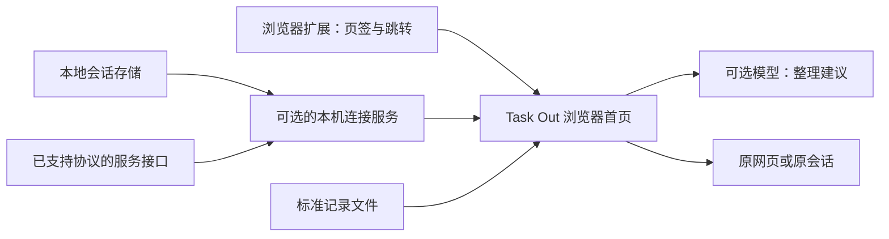

# Task Out 产品方案 v1.0

> 在一个浏览器页面里，按正在做的事整理网页和 Agent 会话，快速看清最近发起了什么、进展到哪里，以及哪些内容可以收起。

状态：产品方案草稿，供评审和后续开发使用。  
更新：2026-09-11。  
代码仓库：[yuuuyua-ux/task-out](https://github.com/yuuuyua-ux/task-out)。后续代码与公开文档在此仓库迭代。  
公开文档约定：本文只使用通用规则和虚构示例，不包含个人会话、机器路径或连接凭据。

## 1. 方案结论

Task Out 面向同时使用浏览器和多个 Agent 工具的个人用户。它提供统一查看和整理入口，原工具继续负责对话与执行。

| 核心决策 | 产品规则 |
|---|---|
| 项目组织内容 | 项目是一级组织，按用户的工作目标命名，不绑定本地工作目录 |
| 类型作为标签 | 调研、需求、开发等是可编辑标签；跨来源统一筛选 |
| 聚合展示 | 每条会话保持独立身份和上下文，不因主题相同而合并对话 |
| Close 即归档 | 一个入口、一套生命周期，可恢复；不代表业务完成或停止 Agent |
| 来源可扩展 | 通过连接器、连接配置和来源识别规则接入，不在首页固定应用列表 |
| LLM 辅助整理 | 用于项目建议、类型标签和近况摘要；手动调整优先，来源和运行状态依靠原始数据 |

**当前已具备的是前端示例 Demo。** 卡片首页、模型设置和整理建议等可交互，但尚未接入真实会话或真实模型。本文描述的发现、连接、同步和扩展能力是后续目标，不代表已经实现。

## 2. 用户问题与产品目标

| 用户要回答的问题 | Task Out 提供的结果 |
|---|---|
| 最近又发起了哪些事情？ | 按原始发起时间查看近期会话及类型分布，区分新会话与旧会话的新进展 |
| 同一件事散在哪些工具里？ | 一个项目卡片内收纳相关网页和独立会话，通过来源图标区分 |
| 哪些事情需要我处理？ | 展示有明确依据的等待状态、最近进展和下一步，支持回到原处 |
| 哪些内容可以暂时收起？ | 单条、整组或当前筛选结果归档，保留记录并支持恢复 |
| 换了工具或电脑还能用吗？ | 发现已有兼容来源、手动调整配置、导入标准记录；核心界面不依赖某个品牌 |

首版建议以以下结果验收，而不是以接入品牌数量衡量价值：

- 无需配置模型，也能接入兼容来源、查看记录、手动归类和归档。
- 不同工具、不同目录的内容可以归入同一项目；同一目录的内容也可以分属不同项目。
- 用户能看出信息是否新鲜、来源是否连通、哪些操作真实可用。
- 在一台没有开发者个人配置的电脑上，可以依据公开说明完成首次使用。

可记录的评估指标包括首次接入成功率、回到原会话的成功率、整理建议采纳率和手动纠正率。首版不默认上传使用数据，先用本地记录与试用反馈建立基线，再确定数值目标。

## 3. 载体与范围

### 3.1 推荐载体

沿用浏览器页面作为统一入口，保留扩展的新标签页形态。读取本地 Agent 数据时，通过可选的本机连接服务完成；它作为后台组件运行，不增加第二套主操作界面。

| 使用方式 | 可用能力 | 边界 |
|---|---|---|
| 浏览器扩展 | 当前浏览器授权范围内的页签、跳转、关闭，以及手动整理 | 不安装本机服务时，不读取本地 Agent 存储 |
| 扩展 + 本机连接服务 | 在网页能力基础上，发现并同步兼容的本地会话或服务接口 | 具体能力按每条连接实际验证结果展示 |
| 普通网页 + 标准导入 | 查看导入记录、手动归类、搜索和本地归档；接入本机服务后可使用模型辅助整理 | 不能读取任意浏览器页签，也不能宣称关闭了真实页签 |

仅将静态页面部署到 GitHub Pages，不能自动读取访问者的本地 Agent 数据，也不获得系统凭据访问能力。首版真实模型调用统一通过本机服务完成，由服务保管凭据并请求配置的模型接口；单独运行的网页或扩展保留手动整理。README 应分开说明产品页面、浏览器扩展和可选本机服务的作用。

### 3.2 首版支持与非目标

| 范围 | 内容 |
|---|---|
| 支持 | 项目卡片、类型标签、来源筛选、近期发起、会话近况、网页直开、稍后查看、归档恢复；来源发现与配置；模型设置与建议预览 |
| 有条件支持 | 实时状态、原会话直达、事件更新等能力，按连接器与当前环境逐项验证 |
| 不支持 | 合并聊天上下文、代发消息、自动接力、统一执行任务、启动或停止 Agent、多用户协作、跨设备同步 |
| 后续扩展 | 更多来源协议、第三方连接器安装、复杂字段映射、规则编辑器和源工具原生归档同步 |

平台兼容范围在开发验证后公布。设计中不使用固定用户名或机器路径，但这不等于首版已支持所有操作系统和浏览器。

## 4. 来源设计：读取方式、连接位置与应用身份分开

### 4.1 核心对象

| 对象 | 用户可以怎样理解 | 规则 |
|---|---|---|
| 连接器 | 一种可用的读取方式，例如浏览器页签、某种会话文件格式、某个服务协议 | 定义如何发现、解析、识别记录，以及支持哪些操作；可以新增和升级 |
| 连接配置 | 我实际要连接的一处数据 | 同一连接器可以添加多条配置，例如个人与工作环境；名称、位置、范围可改 |
| 应用身份 | 这条会话来自哪个应用，或能在哪些应用里打开 | 来自记录中的标记或用户确认；允许未知和多个入口，不等同于文件格式 |
| 统一记录 | 一条独立会话，或一个实际网页页签及其保留记录 | 保留稳定身份和来源依据；项目、标签、归档与用户修正由 Task Out 管理 |
| 能力说明 | 这条连接现在能做什么 | 分别展示历史读取、状态更新、打开原处等能力，不能用一个“已连接”概括全部 |

例如，两个 Agent 产品可能共用同一种会话格式。应读取同一存储一次，再识别每条会话的应用身份；不应为两个品牌各扫描一次，产生两份相同会话。

### 4.2 “不写死来源”的具体要求

| 位置 | 必须支持的变化 |
|---|---|
| 连接器目录 | 新增一种读取方式，不要求修改项目、标签、归档等通用功能 |
| 配置表单 | 按连接器声明的字段显示路径、服务地址、账号范围等输入；没有该能力的字段不出现 |
| 来源筛选与分组 | 根据已接入的来源和记录动态生成，不能只判断几个预置品牌 |
| 图标与名称 | 连接器提供默认图标和名称；可设置本地别名，缺少图标时使用通用标识 |
| 操作按钮 | 按当前记录的可用能力展示；“可读历史”不自动获得“可直达会话” |
| 项目和类型 | 首次使用提供可删除示例；不固定项目名、工作目录和类型全集 |
| 模型 | 支持填写模型名称和服务地址；模型供应商与对话来源互不绑定 |

允许连接器内维护已知格式和候选位置，但这些规则必须可维护、可覆盖，并与通用界面分离。

**扩展分为两种情况：** 新应用使用已有兼容格式时，新增连接配置或身份识别规则即可；新应用使用未支持协议时，需要新增连接器，或先导入标准记录。不能承诺任意目录、任意 URL 都能直接接入。

## 5. 来源发现与配置体验

### 5.1 入口与首次使用

首页顶部提供常驻入口 **“连接与来源”**，与“模型设置”分开。它展示已连接数量、需要处理的连接问题，以及“发现本机来源”“手动添加”“导入记录”三个入口。

首次使用不强制配置 LLM：用户可以先使用浏览器功能，接入其他来源后再决定是否开启 AI 整理。

### 5.2 自动发现流程

1. 用户点击“发现本机来源”。本机服务未就绪时，说明所需组件，并保留手动添加和导入入口。
2. 使用已安装连接器的发现规则，检查约定位置、受支持的环境配置或用户指定范围。不默认遍历整盘、枚举任意网络服务或读取全部会话正文。
3. 展示候选：识别到的格式、显示名称、位置、识别依据和是否已接入。候选不自动加入首页。
4. 用户选择候选、读取范围和刷新方式。可测试读取并预览少量记录，确认将接入哪些内容。
5. 用户启用连接，开始首次同步。首页逐批显示可用内容，连接页显示进度、成功数量和失败项。
6. 同步完成后，分别显示已经验证的能力和未验证能力。支持再次发现，已接入项标记出来，避免重复添加。

发现阶段允许读取格式头或必要的少量元数据用于识别；读取正文样本发生在用户选定候选之后，并且不会因此自动发送给模型。未发现来源时明确提示“未发现已支持的来源”，不能推断电脑上没有 Agent。

### 5.3 连接配置

| 配置项 | 产品行为 |
|---|---|
| 显示名称 | 用户自行命名，例如“工作环境”；只改显示，不改变记录身份 |
| 读取方式 | 从兼容连接器中选择，展示用途与当前版本支持范围 |
| 数据位置 | 选择目录、文件或填写兼容服务地址；默认位置只是建议，允许修改 |
| 账号或环境 | 仅在连接器支持时提供；不同账号不能混为同一存储 |
| 读取范围 | 选择全部兼容内容或指定子范围，支持排除；首次历史默认建议近 30 天有活动的内容，并包含来源明确提供的当前活跃会话，可改为全部 |
| 刷新方式 | 支持时优先事件更新，否则定时或手动；不具备的方式不提供选项 |
| 应用身份 | 自动识别；无法确定时使用通用标识，允许用户确认或纠正 |
| 打开方式 | 使用连接器提供且已验证的入口；需要配置时允许补充，不要求填写任意 shell 命令 |
| 模型使用范围 | 控制该连接是否允许参与 AI 整理，以及可以使用标题、网址、近况等哪些内容 |

目录选择只决定读取范围，不创建同名项目，也不约束项目归属。来源缺少活动时间时，预览中单列时间未知的记录，由用户决定是否纳入，不能按文件复制时间筛掉。改变历史范围后应补充或停止后续读取，不静默删除已整理的记录。

连接详情提供测试、重试、暂停、恢复、编辑和移除。暂停停止后续采集并保留缓存；移除默认断开连接并保留已收录内容，不能删除源文件。若提供清除缓存，另行明确说明并确认范围。

### 5.4 连接状态与能力展示

| 情况 | 界面与行为 |
|---|---|
| 待配置 | 标明缺失项；未通过必要配置前不显示“已连接” |
| 正在同步 | 显示进度，已读取部分可以查看；允许停止后续同步 |
| 可用 | 显示最后同步时间，以及各项已验证能力 |
| 部分可用 | 例如可读历史但不能获取实时状态；保留可用功能并说明限制 |
| 需要授权 / 配置失效 | 保留原配置和缓存，指出需处理的字段，提供重试入口 |
| 暂停 / 离线 | 展示缓存和最后成功同步时间，不持续播放运行中动画 |
| 格式不兼容 | 显示受影响连接及升级或导入方案，其他来源继续工作 |

“测试读取成功”“实时状态可用”“可打开原会话”分别记录结果。后两项应以实际事件或定位验证为依据，不能由配置存在或接口返回成功推定。

## 6. 应用身份与重复记录

### 6.1 应用身份识别

优先使用明确客户端标记和连接器可验证的信息；用户确认作为本地修正保存。未知时展示“来源待识别”，不能靠 LLM、目录名或图标猜测品牌。

以共享的 Claude 格式存储为例：`sdk-ts` 只说明 SDK 入口，不足以唯一证明来自 Mana；`cli` 是 CLI 入口线索，也不能据此识别所有未来客户端。这是格式与应用身份分离的示例，不构成产品对这些品牌的固定依赖。

首版支持纠正单条或所选多条记录的来源，并保存依据。P1 再增加面向未来记录的识别规则：规则预览必须显示适用范围；“将所选记录标为某应用”和“将该范围未来记录也标为该应用”是两个选择，默认只改所选记录。规则可编辑、撤销，冲突时保留待识别状态。

### 6.2 去重与关联

| 场景 | 处理规则 |
|---|---|
| 同一连接重复刷新 | 更新原记录，不新增会话 |
| 同一存储由多条连接发现 | 使用存储身份和原始会话标识关联，首页只显示一条，保留多个可用入口 |
| API 与文件同时提供同一会话 | 只有存在可靠身份对应时才关联；无法证明时标记候选，不强行合并 |
| 客户端名称纠正或新增入口 | 修改身份说明或打开方式，不新建会话，不改变归档和项目 |
| 两个会话标题、内容或主题相似 | 仍是两条独立会话；相似性仅用于归类建议 |
| 多个网页页签 URL 相同 | 保留独立页签身份；重复页签清理作为单独的浏览器操作，不自动合并 |
| 路径迁移、连接重建或备份复制 | 尝试依据稳定标识关联；无法确认时提供迁移预览，不能仅靠新路径认定全部是新会话 |

同一记录存在多个来源观测时，保留各自依据和时间：完整历史不被较少的副本覆盖，旧快照不覆盖更新的可信事件，冲突状态不得静默选择一个品牌作为真值。

## 7. 首页与整理交互

### 7.1 页面结构

延续已评审的暖白背景和多列项目卡片，窄屏自动变为单列。项目是一级组织，可临时切换“按来源”查看，不改变项目归属。

| 区域 | 主要内容与操作 |
|---|---|
| 顶部 | Task Out 名称；按项目 / 按来源；新建项目、调整分组、连接与来源、模型设置、AI 整理 |
| 查询栏 | 搜索标题、项目、标签和可用近况；时间、项目、来源、类型、网页 / 会话筛选 |
| 工作区切换 | 当前内容、稍后查看、归档 |
| 紧凑统计栏 | 近期发起、等待处理、运行中；点击后按明确口径筛选 |
| 项目卡片 | 项目名称、条目数量、会话与网页构成、紧凑条目和整组归档 |
| 条目 | 来源图标与名称、标题、类型、状态或访问时间；右侧书签和 × |
| 会话详情 | 近况、最近活动、明确的下一步、信息时间、来源依据和原工具入口 |

首页默认收起一句近况，可手动打开。来源名称或标题过长时截断，在悬停或详情显示完整内容；键盘可操作标题、书签和归档按钮，不把操作只藏在 Hover 中。

### 7.2 主要操作规则

| 操作 | 结果与边界 |
|---|---|
| 点击网页 | 直接聚焦对应真实页签；已无该页签时打开网址。普通网页模式只能打开网址，不先弹详情 |
| 点击会话 | 查看进展详情；在详情中进入原会话。无直达能力时显示可用的定位信息，打开应用首页不能标为已打开原会话 |
| 新建 / 编辑项目 | 用户定义名称和颜色；空项目也保留，不要求选择文件夹 |
| 拖动 / 移动条目 | 只改 Task Out 的项目归属，立即保存；不移动文件或原会话 |
| 编辑类型或近况 | 保存为用户修正，后续模型和来源刷新不覆盖；原始标题保留，本地更名作为别名 |
| 点击类型 | 筛选同类型的独立记录，不新建聊天上下文 |
| 书签 | 加入或移出稍后查看；归档记录保留书签标记，当前稍后列表默认不含归档 |
| 切换筛选 / 排序 | 不改变内容身份、项目和归档状态；显示当前作用范围 |

搜索无结果时保留输入并提供清除筛选；同步失败时保留已展示内容；归档最后一条内容后保留空项目。详情打开时发生同步，更新内容但不无故关闭抽屉或重置用户正在编辑的字段。

## 8. LLM 配置与 AI 整理

### 8.1 模型与来源独立配置

首版建议支持兼容的 Chat Completions 接口，包括符合该协议的本地模型服务。其他模型协议通过后续模型适配扩展，不因填写了任意 Base URL 就视为兼容。

| 配置 | 规则 |
|---|---|
| 接口地址与模型名称 | 可自行填写，提供预设但不固定供应商或模型 ID |
| 认证 | 支持兼容接口所需的认证；本地无认证服务可留空。真实密钥保存在本机凭据存储，不放进可分享的配置 |
| 分组偏好 | 用自然语言描述项目划分习惯；与程序强制规则区分，不允许偏好覆盖归档、来源身份或用户手动修正 |
| 使用内容 | 按来源选择标题、网址和最近近况；默认不发送会话全文、附件或本地路径 |
| 自动生成建议 | 默认关闭；开启后只为新增或变化内容生成建议，首版不自动应用 |
| 测试与状态 | 保存配置只表示保存成功。连接测试使用不含真实会话的样例；真实请求成功后再显示连接结果和时间 |

默认去除网址中的认证信息、查询参数和片段后再发给模型；确实需要额外内容时由用户调整发送范围。来源禁止外发的设置优先于全局模型设置，整理预览应说明哪些条目因此被排除。

同一记录关联多个连接时，发送范围按每项内容的实际来源核对。禁止来源提供的内容不能通过另一连接绕过限制；无法区分字段来源时，采用更严格的限制，并在预览中说明排除原因。

### 8.2 整理流程

1. 用户点击“AI 整理”，选择全部待归类内容或当前筛选结果；默认不处理归档。
2. 显示所用模型、条目数、涉及来源和发送内容范围。用户发起本次整理后才请求模型；已开启自动建议的来源遵循已保存范围，不逐条重复确认。
3. 根据已有项目、类型和分组偏好生成建议。优先建议已有项目；需要新项目时展示名称候选，由用户选定后创建。
4. 展示修改前后：项目、类型、一句近况及简短依据。不确定的条目留在待归类，不伪装成确定归属。
5. 用户逐条或批量选择建议，也可调整建议后应用。仅应用选中的项目、标签或近况；未选择部分保持原值。
6. 提供本次应用结果与撤销。用户的手动归属和修改默认保留，只有明确选择“重新建议”并应用后才可替换。

输入和输出都应限定长度、字段和可用项目。会话或网页正文只是待整理材料，其中的指令不能改变连接配置、触发归档或执行外部操作。

### 8.3 失败和冲突

| 情况 | 处理 |
|---|---|
| 未配置模型 / 请求失败 | 保留手动归类、来源分组等基础能力；已有项目和标签不变化 |
| 超时或用户取消 | 停止后续请求，已返回部分可以查看，不自动应用 |
| 返回格式错误或无效项目 | 标明失败项，保留原内容，允许重试，不凭无效结果建立项目 |
| 内容没有变化 | 复用适用的整理结果，避免重复发送整份历史；模型或偏好变化后可主动重新整理 |
| 预览后内容又被修改 | 应用前核对记录变化，跳过冲突项并刷新建议，不覆盖用户的新操作 |
| 撤销时已有后续修改 | 只撤销本次仍可还原的字段；冲突项说明原因，不回滚其他新操作 |

来源身份、创建时间、实际运行状态、归档与否都不是 LLM 的决策范围。AI 近况保留依据时间，正文中明确的待办与模型补充建议分开显示。

## 9. 时间与进展口径

| 信息 | 口径 |
|---|---|
| 最近发起 | 原始会话创建时间；包含后来已归档的会话。按当前类型标签统计，多标签总数可能高于会话数 |
| 最近进展 | 最后一次有效消息或执行活动时间，不使用扫描时间或文件复制时间替代 |
| 首次收录 | Task Out 第一次发现记录的时间；原始创建时间缺失时明确标注，不混入已知发起统计 |
| 最后同步 | 最近一次成功获取来源数据的时间，用于说明信息新鲜度 |
| 网页活动 | 使用可得的打开或访问时间，网页不计入会话发起统计 |

运行状态包括运行中、等待处理、本轮结束、异常和未知。只有当前仍可信的明确状态进入运行中或待处理数量；读取历史但没有实时状态时显示未知。连接失联后显示“上次状态”和时间，不能把沉默推断为完成。

不把一轮回复结束等同于业务完成，不生成缺乏依据的进度百分比。子代理或工作流日志默认作为所属会话的活动；只有明确是独立、用户可查看的会话时才单列，无法识别时说明覆盖限制。

## 10. 归档与恢复

### 10.1 一个入口，两类执行规则

| 对象 | 点击 × | 恢复 |
|---|---|---|
| 有浏览器控制能力的真实页签 | 先保存可恢复记录，再关闭选中的具体页签并归档 | 重新打开保存的网址并关联原归档记录；重复点击不能打开多份 |
| 会话 | 归档 Task Out 中的记录，不停止执行，不默认调用源工具原生归档 | 恢复到原项目；不发消息、不启动新运行 |
| 导入或仅有网址的保留记录 | 归档 Task Out 中的记录，不宣称关闭了浏览器页签 | 恢复列表记录，可继续点击网址 |

单条、整组和当前筛选结果遵循同一规则。批量按钮写明数量和范围；部分成功时只处理成功项，保留失败项与重试入口。

### 10.2 同步与失败边界

- 保存失败不主动关闭网页；关闭失败保留可见的待处理状态，不显示全部归档成功。关闭结果不确定时，先重新核对对应页签，不盲目重复操作。
- 用户在浏览器原生界面关闭已收录页签时同步归档；短暂断连、窗口清单不完整或浏览器重启不能仅凭“没查到”就认定已关闭。
- 归档会话有新活动时更新归档记录，标记“归档后有更新”，不自动回到当前列表。
- 刷新、重新接入、重新分类和客户端纠正都不能使归档记录重新出现为新内容。
- 已归档会话在源工具中消失时保留现有记录与失效提示；恢复 Task Out 记录不能称为恢复了源会话。
- 恢复网页不能承诺恢复表单、滚动位置或登录状态。用户自行新开的独立页签仍是新条目，不与旧归档按 URL 自动合并。

## 11. 同步与数据责任

| 数据 | 事实来源与修改规则 |
|---|---|
| 会话原始身份、标题、消息、活动与状态 | 来源工具负责；Task Out 缓存必要内容，不改写源日志 |
| 项目、标签、别名、书签、归档与人工身份修正 | Task Out 负责；独立持久保存，不因重采集而重置 |
| AI 建议与近况 | 衍生结果；保留输入依据时间、应用状态和模型信息，不冒充原始事实 |
| 连接配置与能力状态 | 本机配置和实际探测结果共同决定；测试时间与配置版本一并显示 |

同步优先增量处理；同一会话反复读取应更新原记录。文件正在写入时只处理完整有效记录，尾部半行留待下次，单条解析失败不让整个来源消失。

首次同步或部分同步失败时保留成功部分，显示覆盖范围。来源暂时消失与明确删除分开处理；不因目录一时不可用、权限撤回或空接口响应批量删除已收录内容。

连接器升级、更换地址和收窄读取范围时，保留用户整理结果。配置格式需要版本标识；不兼容更新应提示迁移并保留旧配置，不能静默重置。

## 12. 面向 GitHub 的产品与交付要求

### 12.1 公共内容与个人数据分离

公开仓库应只包含产品代码、通用文档、配置模板、连接器说明和虚构示例。个人运行状态应存放在仓库外的本机应用数据位置；真实凭据单独保存，不写在前端静态文件中。

| 内容 | 公开或导出规则 |
|---|---|
| 配置模板 | 使用变量和占位值，标明哪些项由用户首次运行时填写；不包含开发者路径、账号或服务地址 |
| 连接配置导出 | 默认输出可分享模板，去除机器路径、私有地址和凭据；用户需要迁移原配置时另选本地备份 |
| 内容数据导出 | 用户主动操作的个人备份，与分享配置分开；明确包含标题、网址或近况，不作为公共示例 |
| 凭据 | 不进入普通导出、日志、截图或示例数据；另一台机器导入后重新配置 |
| Demo | 公开版使用虚构项目、会话标题和可公开网址；不直接把个人评审样本当开源样本 |
| 日志与诊断 | 默认仅记录连接状态、错误类别和必要定位信息；分享诊断前可预览，不默认附带正文和密钥 |

本机连接服务应仅向已授权的 Task Out 页面或扩展提供受限数据访问。任意网页不能借它读取本机文件；配置指定的范围之外不继续采集，解析后的真实路径也须满足范围限制。

保留原 Tab Out 的许可和来源说明。正式发布前更新 README 与安装引导，区分继承能力、Task Out 新增能力和待实现能力；启用外部模型后不能继续无条件宣称“任何数据都不会离开本机”。

### 12.2 连接器扩展约定

连接器至少说明：唯一名称与版本、支持的格式或协议、发现方法、配置项、稳定记录标识、客户端识别依据、各项可用能力、兼容范围、失败表现和虚构样例。

新连接器通过统一接口向首页提供记录，不能要求在首页增加品牌判断。首版只运行随版本提供并验证过的连接器；用户导入配置不能自动安装或执行第三方代码。后续开放第三方安装时，另行设计来源、版本兼容和权限说明。

首批兼容验证可以选择 Codex、Claude 格式会话存储及其兼容客户端等常见来源，但它们只是适配目标。缺少其中任意一个，不影响产品启动，也不影响接入其他兼容来源。

### 12.3 通用导入的边界

首版支持标准 JSON / JSONL：每个对象表示一条已整理的会话或网页记录，而不是任意工具的原始事件行。提供公开字段说明、虚构样例、导入预览和失败行提示。

导入前确认数据集身份，保留来源的稳定记录标识；重复导入更新同一记录。缺少可追溯身份时提示去重限制，不根据标题相同自动合并。

任意事件日志的会话重建、字段映射编辑器和自动识别未知格式放到后续版本。这样既给暂未适配工具保留入口，也不把“可配置”包装为无需适配即可读取一切。

## 13. 实施顺序与范围控制

| 阶段 | 交付内容 | 进入下一阶段的条件 |
|---|---|---|
| 当前：方案与 Demo | 已确认的首页与整理交互；本方案明确来源扩展规则 | 产品规则评审通过，明确首批验证环境 |
| P0：可用首版 | 真实浏览器操作；可扩展来源目录；发现、添加、测试、暂停与移除；项目归类、进展、归档；标准导入；一个兼容模型协议 | 完成核心验收；浏览器和标准导入之外，至少跑通两种不同协议或格式的实际会话读取，验证通用设计 |
| P1：更广接入 | 更多连接器与平台、配置迁移、身份规则管理、导入字段映射、更好的自动建议 | 新来源不修改通用首页；用户修正与历史归档稳定保留 |
| 后续评估 | 第三方连接器安装、跨设备同步、源工具归档同步 | 单独定义权限、冲突和维护成本，不并入当前首版承诺 |

同格式的两个品牌不能代替不同读取方式的验证；发布时列明各连接器实际支持的能力。P0 的模型设置支持手动请求和可选自动生成建议，所有建议先预览后应用。首版不以“自动应用率”替代分类可靠性，也不为了接更多品牌牺牲来源识别和状态真实性。

正式公开发布前，应完成一台干净环境的首次使用验证，确保示例配置不依赖开发者机器。本文为设计方案，正式发布尚未启动。

## 14. 核心验收场景

| 场景 | 操作 | 预期结果 |
|---|---|---|
| 无预置品牌 | 只启用浏览器或标准导入 | 产品可用，无固定应用缺失报错；来源筛选根据实际数据生成 |
| 自动发现 | 同时存在兼容、未知和已接入来源 | 显示候选与依据；不自动读取全部历史，未知格式有手动或导入路径 |
| 修改位置 | 在非默认位置配置兼容存储 | 可测试并同步；不依赖固定用户名、项目目录或安装路径 |
| 同连接器多配置 | 添加工作与个人两处存储 | 范围分明，可分别暂停和配置；不混淆账号和稳定身份 |
| 共享存储 | 两个应用入口指向同一会话 | 首页只显示一条，保留来源依据；单一 SDK 标记不会被固定归为某品牌 |
| 未知来源 | 导入没有客户端标记的有效记录 | 通用图标、来源待识别；用户纠正后项目和归档不变 |
| 能力不完整 | 仅提供历史，随后中断连接 | 显示历史与缓存时间；状态未知，不显示虚假的实时能力 |
| 项目独立 | 将不同目录、不同来源的会话移入同一项目 | 只改变 Task Out 归属，源文件和会话上下文保持独立 |
| 时间真实 | 导入三个月前的历史，刷新并修改标签 | 不计为今天发起；标签修改不制造新进展 |
| LLM 配置 | 保存接口、测试连接、请求真实整理 | 保存与连接状态分开；不使用真实会话测试；无模型时基础功能仍可用 |
| 模型发送范围 | 选择含禁止外发来源的混合批次 | 被禁止内容不发送，预览说明排除项；允许范围内才生成建议 |
| 多连接权限冲突 | 同一会话关联允许外发和禁止外发的连接 | 不借另一入口发送受限内容；无法分辨字段来源时采用更严格限制 |
| 手动调整优先 | 修改项目后重新整理，在预览期间再编辑条目 | 保留手动结果；冲突项不被旧建议覆盖 |
| 归档持续有效 | 归档后刷新、改连接名称或来源身份，源会话继续活动 | 保持归档，更新归档内近况，不重新创建当前条目 |
| 网页关闭与恢复 | 对同网址两个页签归档其中一个，再恢复 | 仅关闭选中实例，另一页签保留；恢复重复操作不产生多份 |
| 单来源故障 | 一个来源权限失效，另一个正常同步 | 正常来源继续工作；失败来源保留缓存和处理入口 |
| 公开配置可迁移 | 将无个人数据的配置模板导入新环境 | 提示补充本机位置和凭据，进入待配置，不虚报已连接 |
| 新增兼容来源 | 为已有格式增加另一连接配置及新应用标识 | 不修改首页品牌分支，图标、筛选、归档与项目功能自动适用 |

## 15. 开发前需要验证的事项

| 事项 | 当前建议 | 状态 |
|---|---|---|
| 首批操作系统和浏览器 | 先覆盖主要使用环境，再发布兼容矩阵 | 待实机验证 |
| 首批会话连接器 | 选择至少两种不同读取方式，先稳定获取历史与身份 | 候选明确，具体能力待验证 |
| 实时状态与直达入口 | 分别验证，不用“历史可读”代替 | 待逐项验证 |
| 本机服务的安装和启动 | 单次配置、状态可见、失败可恢复，不能要求用户每次手动拼接命令 | 交互目标已定义，实现方式待选型 |
| 旧 Tab Out 数据迁移 | 保留原保存项，迁入 Task Out 时提供预览，不将网站或目录名直接设为项目 | 待核对现有数据格式 |
| 发现与同步性能 | 建立小规模与大历史样本，测首次结果耗时和更新延迟，再定发布指标 | 待基线验证 |

以上问题影响接入范围与交付顺序，不改变“项目一级组织、类型标签、来源可扩展、各会话独立、Close 即归档”的产品方向。
